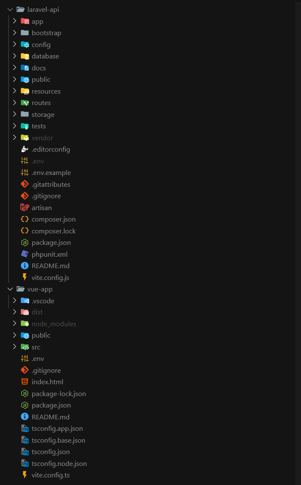
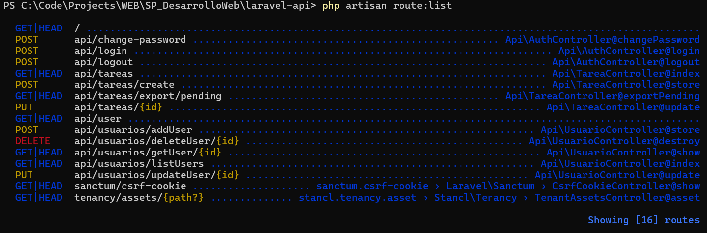
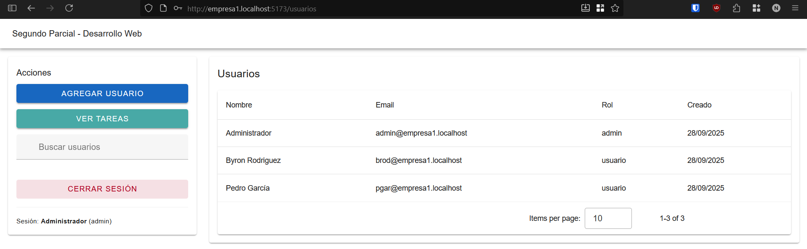

# Documentación General del Proyecto

> Archivo: `00-general.md`
> Estado funcional del sistema antes de reforzar protección con middleware y roles.

## 1. Descripción Breve

Aplicación API REST desarrollada en Laravel (PHP 8.2.x) consumida por un frontend en Vue.js. A esta altura ya existían:

-   Migraciones y modelos de `usuarios` y `tareas`.
-   Endpoints básicos CRUD de usuarios y creación/listado de tareas.
-   Lógica de autenticación inicial (login / emisión de token) pero SIN middleware aplicado en las rutas (endpoints aún accesibles sin token).

Esta sección representa el estado previo a:

-   Protección real de endpoints con `auth:sanctum`.
-   Incorporación de middleware `admin` para operaciones restringidas.
-   Aislamiento multitenant efectivo y despliegue productivo.

## 2. Stack Tecnológico Base

-   Backend: Laravel
-   Frontend: Vue 3 + Vite
-   Base de datos: MySQL
-   ORM: Eloquent
-   Gestión de dependencias: Composer / NPM

## 3. Estructura Relevante

```
laravel-api/
  app/Models/Usuario.php
  app/Models/Tarea.php
  app/Http/Controllers/Api/UsuarioController.php
  app/Http/Controllers/Api/TareaController.php
  routes/api.php
  database/migrations/*_create_*_table.php
vue-app/
  src/
    services/
    views/
```

## 4. Flujo Base (antes de protección con middleware)

1. Frontend consumía endpoints sin requerir token (no aplicado `auth:sanctum`).
2. Se podía crear usuarios y tareas sin autenticación efectiva.
3. Migraciones ya presentes para `usuarios` y `tareas`.
4. Existía campo `rol` en usuarios pero sin lógica de bloqueo en backend ni guardas de ruta en frontend.

## 5. Algunos Endpoints (antes de aplicar middleware)

Formato original (nombres podían variar levemente antes de estandarizarse):
| Método | Ruta | Situación previa |
|--------|---------------------------------|------------------|
| GET | /api/usuarios (o /usuarios/list)| Listado abierto |
| POST | /api/usuarios (o /usuarios/add) | Creaba sin token |
| GET | /api/usuarios/{id} | Acceso abierto |
| PUT | /api/usuarios/{id} | Actualización abierta |
| DELETE | /api/usuarios/{id} | Eliminación abierta |
| GET | /api/tareas | Listado tareas abierto |
| POST | /api/tareas/create | Crear tarea abierta |

> Nota: Luego se protegieron con `auth:sanctum` y/o `admin` cuando era relevante.

## 6. Modelo `Usuario` y `Tarea`

Campos típicos: nombre, email (único), password hasheado, timestamps, estado, etc.

## 7. Migraciones Clave

-   `create_usuarios_table`
-   `create_tareas_table`

## 8. Capturas

| Nombre archivo                       | Descripción                             |
| ------------------------------------ | --------------------------------------- |
| `general-estructura-proyecto.png`    | Vista de estructura de carpetas inicial |
| `general-endpoints.png`              | Lista de endpoints de la applicación    |
| `general-front-listado-usuarios.png` | Vista frontend listando usuarios        |

**Estructura:**

**Endpoints:**

**Listado Usuarios:**


---

Siguiente documentación: ver `01-autenticacion.md` para los cambios de seguridad.
