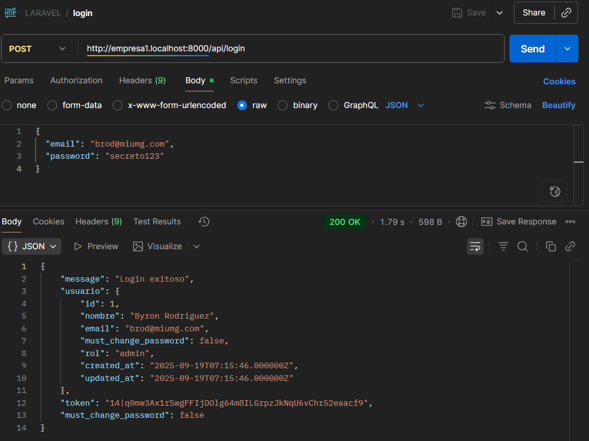
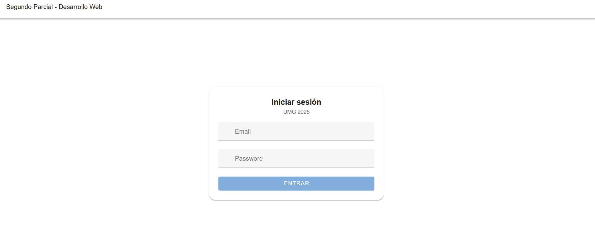
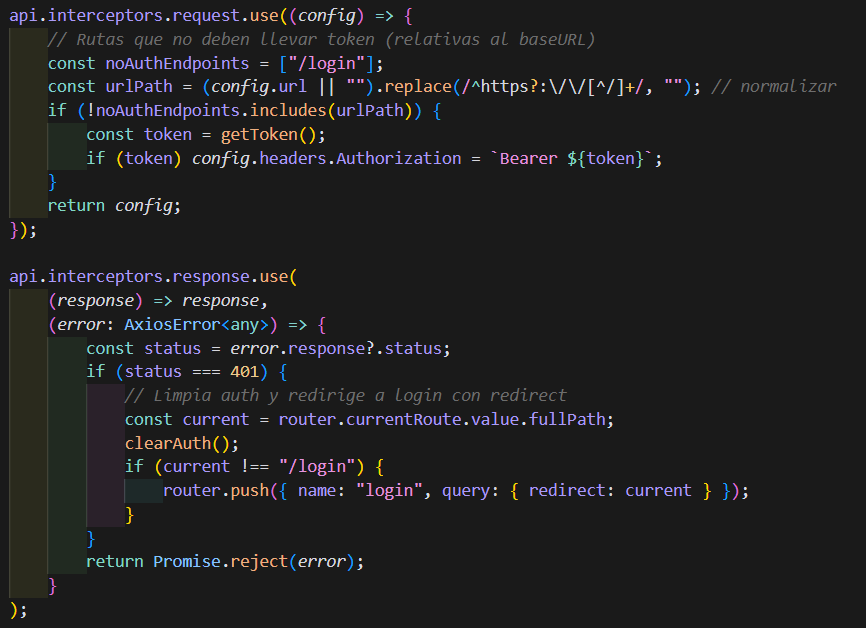

# Autenticación y Protección de APIs

> Archivo: `01-autenticacion.md`
> Autenticación de Usuario

## 1. Estrategia Implementada

Se utilizó Laravel Sanctum para:

-   Generación de tokens personales.
-   Protección de rutas API mediante middleware `auth:sanctum`.

## 2. Objetivos Cubiertos

-   Login con credenciales (email + password).
-   Validación de token en cada operación CRUD.
-   Respuesta 401 si el token es inválido o ausente.
-   Almacenamiento seguro de password (hash bcrypt).

## 3. Flujo de Autenticación

1. Usuario envía POST /api/auth/login con email y password.
2. Backend valida credenciales y genera token Sanctum.
3. Frontend guarda token (localStorage).
4. Cada petición subsecuente incluye header:
   `Authorization: Bearer <token>`
5. Logout: invalida/elimina el token.

## 4. Endpoints Relacionados

| Método | Ruta                          | Descripción                      | Protección   |
| ------ | ----------------------------- | -------------------------------- | ------------ |
| POST   | /api/login                    | Autenticación y emisión de token | Público      |
| POST   | /api/logout                   | Revocación de token              | auth         |
| GET    | /api/user                     | Usuario autenticado              | auth         |
| GET    | /api/usuarios/listUsers       | Listar usuarios                  | auth         |
| GET    | /api/usuarios/getUser/{id}    | Ver detalle usuario              | auth         |
| POST   | /api/usuarios/addUser         | Crear usuario                    | auth + admin |
| PUT    | /api/usuarios/updateUser/{id} | Actualizar usuario               | auth + admin |
| DELETE | /api/usuarios/deleteUser/{id} | Eliminar usuario                 | auth + admin |
| GET    | /api/tareas/                  | Listar tareas                    | auth         |
| POST   | /api/tareas/create            | Crear tarea                      | auth + admin |
| PUT    | /api/tareas/{id}              | Actualizar tarea                 | auth + admin |
| GET    | /api/tareas/export/pending    | Exportar tareas pendientes (CSV) | auth + admin |

## 5. Middleware Aplicado

-   Grupo `api`: `auth:sanctum` aplicado a grupos de rutas.
-   Middleware personalizado `admin`: restringe creación/actualización/eliminación (usuarios y tareas administrativas).
-   Patrón en rutas:
    ```php
    Route::middleware('auth:sanctum')->group(function(){
            Route::get('/usuarios/listUsers', ...); // acceso general autenticado
            Route::middleware('admin')->post('/usuarios/addUser', ...); // solo admin
    });
    ```

## 6. Ejemplo de Respuesta Exitosa Login

```json
{
    "token": "eyJ0eXAiOiJKV1QiLCJhbGciOi...",
    "usuario": {
        "id": 7,
        "nombre": "Byron",
        "email": "byron@example.com"
    }
}
```

## 7. Validaciones / Errores

-   Credenciales inválidas -> 401.
-   Token expirado o revocado -> 401.
-   Falta de header Authorization -> 401.
-   Acceso a operación admin con rol "usuario" -> 403.

## 8. Integración Frontend

Pasos típicos:

1. Formulario login (email/password).
2. Llamada a `/api/auth/login` con Axios.
3. Guardar token.
4. Interceptor Axios añade header automáticamente.
5. Manejo de expiración: si 401 -> redirigir a login.

## 9 Seguridad

-   Password hasheado (`Hash::make`).
-   No se retornan passwords ni tokens completos en logs.
-   Tokens revocables (logout).

## 10. Autorización por Roles

Se añadió un control explícito de rol:

| Operación                             | Rol requerido          |
| ------------------------------------- | ---------------------- |
| Listar usuarios                       | cualquiera autenticado |
| Ver usuario                           | cualquiera autenticado |
| Crear / actualizar / eliminar usuario | admin                  |
| Crear / actualizar tarea              | admin                  |
| Exportar tareas pendientes            | admin                  |

Ejemplo respuesta 403 (usuario sin permisos):

```json
{
    "message": "No autorizado: solo admin puede crear usuarios."
}
```

El frontend añade `meta: { roles: ['admin'] }` en rutas sensibles (`/usuarios/nuevo`, `/usuarios/:id/editar`, `/tareas/nueva`) y el router bloquea navegación si el rol no coincide.

## 11. Capturas

| Archivo                        | Descripción                          |
| ------------------------------ | ------------------------------------ |
| `auth-login-postman.png`       | Petición exitosa de login en Postman |
| `auth-proteccion-endpoint.png` | Redirección sin autorización         |
| `auth-frontend-form-login.png` | Formulario de login en Vue           |
| `auth-interceptor-config.png`  | Código del interceptor de Axios      |

**Login Postman:**

**Protección Endpoint:**

**Formulario Login:**

**Interceptor:**


---

Siguiente: ver `02-multitenancy.md` para aislamiento por tenant.
