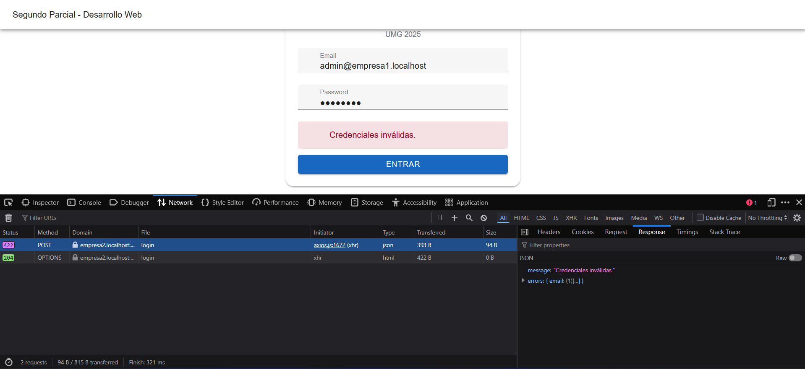

# Multitenancy (Aislamiento por Tenant)

> Archivo: `02-multitenancy.md`
> Proyecto Multitenant

## 1. Implementación

Se configuró la aplicación para servir múltiples tenants (clientes) bajo distintos subdominios. Cada tenant posee su propia base de datos independiente; los usuarios y tareas de un tenant no son visibles en otro.

## 2. Enfoque Técnico

-   Paquete utilizado: `stancl/tenancy`
-   Resolución de tenant basada en subdominio: `empresaX.midominio.com` (en este caso `empresaX.localhost`)
-   Inicialización de contexto tenant antes de despachar rutas protegidas.

## 3. Flujo de Resolución

1. Llega la petición a Laravel.
2. Middleware de Tenancy detecta subdominio.
3. Carga configuración de conexión (database/schema) del tenant.
4. Se aíslan los modelos Eloquent al esquema correspondiente.

## 4. Migraciones por Tenant

-   Migraciones globales: tablas tenants y domains.
-   Migraciones específicas: tablas usuarios, tareas, auth.

## 5. Rutas / Middleware Clave

La inicialización del tenant se inyecta directamente en los grupos `web` y `api` dentro de `app/Http/Kernel.php`:

```php
protected $middlewareGroups = [
  'web' => [
      \Stancl\Tenancy\Middleware\InitializeTenancyByDomain::class,
      \Stancl\Tenancy\Middleware\PreventAccessFromCentralDomains::class,
      // ... resto middleware web
  ],
  'api' => [
      \Stancl\Tenancy\Middleware\InitializeTenancyByDomain::class,
      \Stancl\Tenancy\Middleware\PreventAccessFromCentralDomains::class,
      // ... resto middleware api
  ],
];
```

De esta forma, cualquier ruta definida en `routes/api.php` o `routes/web.php` ya llega con el contexto del tenant resuelto (según el subdominio).

1. El subdominio (ej. `empresa1.localhost`) activa el middleware `InitializeTenancyByDomain`.
2. Ese middleware determina el tenant y ajusta la conexión de base de datos antes de ejecutar el controlador.
3. Los controladores operan ya dentro del tenant correcto (no se requiere código extra dentro de ellos para seleccionar tenant).

## 6. Modelos Relevantes

-   `Tenant` (identificador + dominio)
-   `Usuario` (scoped al tenant actual)
-   `Tarea` (relación belongsTo Usuario dentro del mismo tenant)

## 7. Consideraciones de Seguridad

-   Validación de dominio antes de servir datos.
-   La verificación de rol (middleware `admin`) se ejecuta después de la resolución del tenant, garantizando que las operaciones administrativas se limiten al espacio de datos correcto.
-   Lectura de tareas/usuarios accesible a cualquier usuario autenticado del tenant; mutaciones y exportaciones requieren rol admin.

## 8. Capturas

Guardar en `docs/images/`:
| Archivo | Descripción |
|---------|-------------|
| `multi-bd-tenants.png` | Vista de registros tenants y BDs |
| `multi-subdominio-empresa1.png` | Petición API bajo empresa1._ |
| `multi-subdominio-empresa2.png` | Petición API bajo empresa2._ |
| `multi-bd-aislados.png` | Demostración de aislamiento de datos |

**Tablas de tenants/domains y BDs individuales:**

**Petición listUsers a empresa1:**

**Petición tareas a empresa2:**

**Intento de login con credenciales de empresa1 en empresa2:**


---

Siguiente: ver `03-despliegue-ec2.md` para detalles de despliegue.
