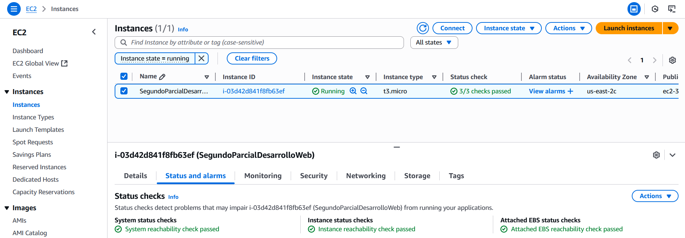
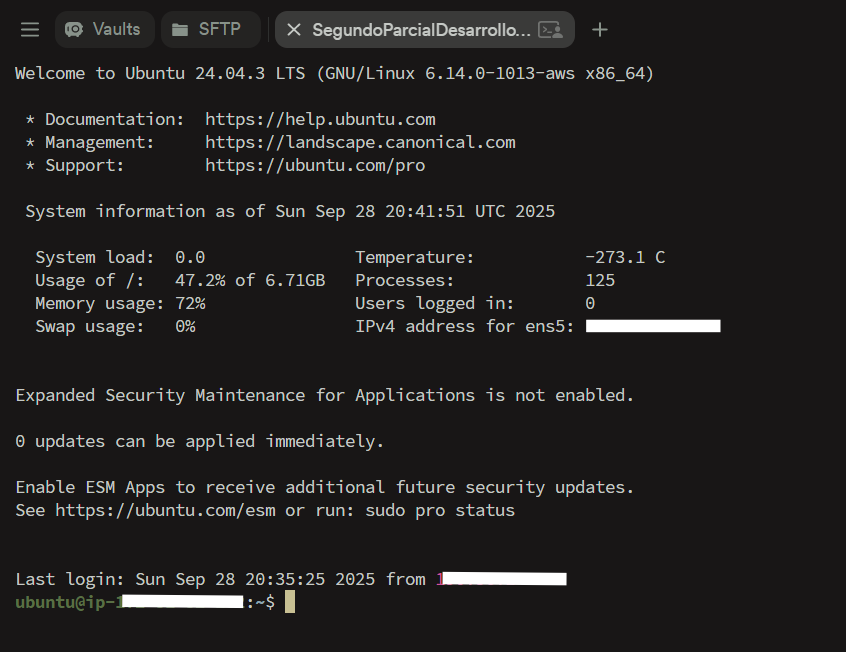
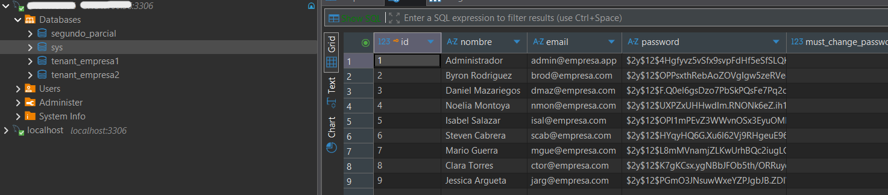
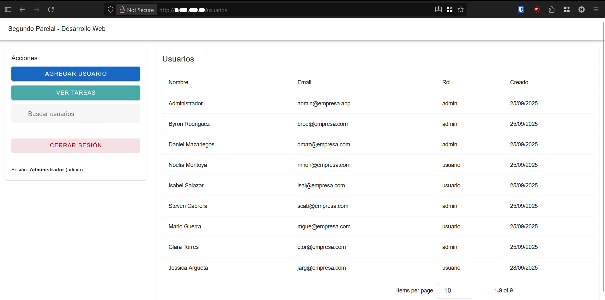

# Despliegue en AWS EC2

> Archivo: `03-despliegue-ec2.md`
> Despliegue

## 1. Objetivo

Ejecución del backend Laravel + frontend compilado (Vue) en una instancia EC2 accesible públicamente, con autenticación y endpoints funcionales.

> Nota: Multitenancy no fue aplicado en esta parte del proyecto

## 2. Infraestructura Usada

-   AWS EC2: (Tipo instancia: t3.micro)
-   SO: Ubuntu
-   Servicios instalados: PHP 8.2, Composer, Node 18+, MySQL, Apache.

## 3. Pasos Principales Realizados

1. Crear instancia EC2.
2. Conectar vía SSH y actualizar paquetes.
3. Instalar PHP + Apache2 y otros servicios.
4. Instalar Composer.
5. Copiar el proyecto en la instancia (Servir frontend de Vue desde `public/app` luego de compilar)
6. Configurar `.env` (DB, APP_KEY, SANCTUM_STATEFUL_DOMAINS, SESSION_DOMAIN, etc.).
7. Ejecutar:
    - `composer install`
    - `php artisan key:generate`
    - `php artisan migrate`

## 5. Variables de Entorno Relevantes

| Variable                 | Descripción                   |
| ------------------------ | ----------------------------- |
| APP_ENV                  | production                    |
| APP_KEY                  | Llave generada                |
| APP_URL                  | IP pública de EC2             |
| DB\_\*                   | Config DB principal           |
| SANCTUM_STATEFUL_DOMAINS | Lista de dominios/subdominios |
| SESSION_DOMAIN           | IP pública de EC2             |

## 6. Optimización Post-Deploy

-   `php artisan config:cache`
-   `php artisan route:cache`
-   `php artisan view:cache`

## 7. Validaciones Realizadas

-   Login funcional (token válido)
-   CRUD usuarios protegido
-   Descarga de reporte de tareas pendientes

## 8. Capturas

| Archivo                    | Descripción                     |
| -------------------------- | ------------------------------- |
| `ec2-instancia-panel.png`  | Vista consola AWS instancia     |
| `ec2-conexion-ssh.png`     | Sesión SSH                      |
| `ec2-databases.png`        | Bases de datos en EC2           |
| `ec2-login-produccion.png` | Dashboard en entorno productivo |

**Instancia en AWS:**

**Sesión SSH con Termius:**

**Bases de datos en EC2:**

**Dashboard en EC2:**

---

Fin de la documentación evaluada. Volver a `00-general.md` para contexto inicial.
